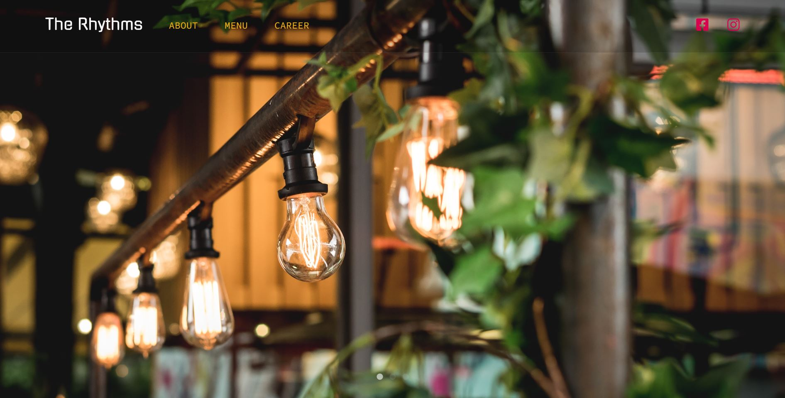

### The Rythms Restaurant

`Restaurant page I created just to practice webpack so the content doesn't make any sense.`

### Project use: 

+ HTML5
+ CSS3
+ Vanilla Js

### Preview

### Live demo

***[The Rythms restaurant](https://h-pk-11.github.io/Restaurant-page/)***

### Usage

##### At Homepaga you have 4 links in the navbar:

+**About**: to direct to about section 
+**Menu**: to direct to menu section 
+**Career**: to direct to career section 
+**the logo**(***The Rythms***): to get back to Home page 

### Deploy on Github pages

Deployed on ***[GitHub Pages](https://pages.github.com/)*** 

### Acknowledgement

Design inspired by ***[albi](https://www.albidc.com/)***